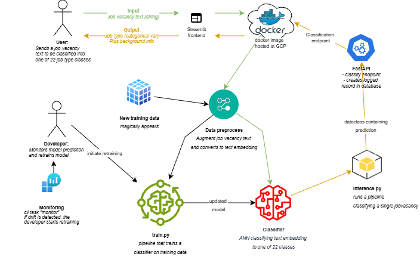

## ML Ops Project
Our main objective with this project is to create a machine learning process that extracts data from Jobnet, transforms it, and uses it to train a model to match an external job vacancies to one of Jobnet's predefined job categories.

The framework of the project is as follows:
1. **Data Extraction**: From a private database we extract job vacancies from Jobnet. Data is tabular with fields of  the job vacancy text itself and 22 classes of job type. Job vacancy texts contain personal information and noisy text not relevant to the job type, which is cleaned using GLINER2 configure to only extracts occupation, skills and task. These are then rewritten to a string to be more compatible with a standard SentenceTransformer embedding model. This data is made available to the entire group.
2. **Data Transformation**:
    The extracted data text are transformed into a text embedding using SentenceTransformer.
    Returns transformed data of labelled classes to vector embeddings of a pytorch tensor datatype of floats.
    The model chosen is *sentence-transformers/paraphrase-multilingual-mpnet-base-v2*, which is an older but standard multilingual text embedding model. For further performance could be considered, models such as *intfloat/multilingual-e5-large-instruct* can be used - which requires a prefix, or finetuning a text embedding model with SentenceTransformerTrainer using GenAI to judge triplet textdata of anchor: posive,negative data.
3. **Model Training**: We use the transformed data to train a machine learning model. It is simply a logistic regression that takes the 1024 dim embeddings and outputs logits for the 22 classes. The models can be quantized to int8 weights and pruned for the 20% smallest weights.
4. **Model Evaluation**: After training, we evaluate the model's performance using accuracy. We use hold-one-out cross validation, and furthermore split the training set into a training and validation set. We also make confusion matrices for the models.
5. **Deployment**: Finally, we deploy the trained model to a production environment where it can be used to classify new job vacancies and match them to Jobnet's categories.# mlopsg24

jobannonce classifier

## Architectual overview of inference and retraining pipeline


## Project structure

The directory structure of the project looks like this:
```txt
├── .github/                  # Github actions and dependabot
│   ├── dependabot.yaml
│   └── workflows/
│       ├── codecheck_format  # makes a basic ruff check
│       ├── deploy_docs       # deploys a mkdocs to github
│       └── tests.yaml        # unit and integraiton tests
├── configs/                  # N/A Configuration files N/A
├── data/                     # Data directory
│   ├── processed             # texts processed to tensors and split into train/test/val
│   ├── drift                 # "database" of for data drift monitoring
│   └── raw                   # Text data from jobopslag
├── dockerfiles/              # Dockerfiles
│   ├── api.Dockerfile
│   └── train.Dockerfile
├── docs/                     # Documentation
│   ├── images                # images for markdowns
│   ├── mkdocs.yml            # builds a mkdocs
│   └── source/               # md files for mkdocs
├── models/                   # Trained model weigths, and pretrained Hugginface models
├── notebooks/                # N/A Jupyter notebooks
├── reports/                  # Reports
│   ├── monitoring/           # data drift monitoring reports in html
│   ├── figures/
│   └── data_create_html      # jupyter interactive output of data_create.py
├── src/                      # Source code
│   ├── mlopsg24/
│   │   ├── __init__.py
│   │   ├── api.py            # FastAPI endpoint
│   │   ├── data_create.py    # extracts data from a private db - cannot be run
│   │   ├── data_drift.py # monitoring data drift reports
│   │   ├── data_preproces.py # module to embed texts
│   │   ├── frontend.py       # streamlit frontend
│   │   ├── inference.py      # inference pipeline on a single data point
│   │   ├── model.py         # the ANN
|   |   ├── modified_model_timer.py # times the standard, quantized, pruned and quant+pruned models
│   │   ├── train.py          # training pipeline
│   │   └── visualize.py      # N/A
└── tests/
│   ├── __init__.py
│   ├── unittests.py
│       └── test_data_preprocess.py   # example of unit test on preprocess pipeline
│   └── unittests.py
│       └── test_api.py       # example of integration test on the api
├── .gitignore
├── .pre-commit-config.yaml   # standard precommits and a local safetymeasure against pushing datafiles
├── LICENSE
├── pyproject.toml            # Python project file
├── README.md                 # Project README
├── requirements.txt          # N/A Project requirements
├── requirements_dev.txt      # N/A Development requirements
└── tasks.py                  # CLI Project tasks using invoke
```
