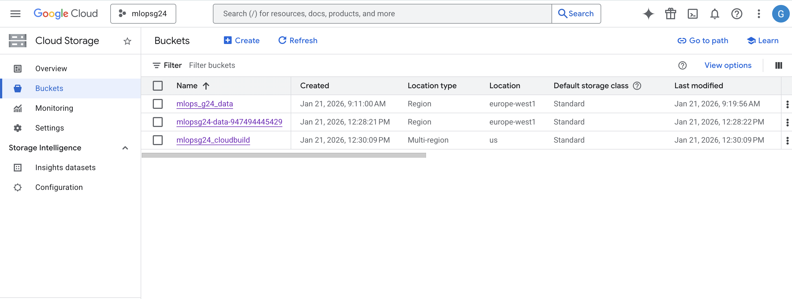
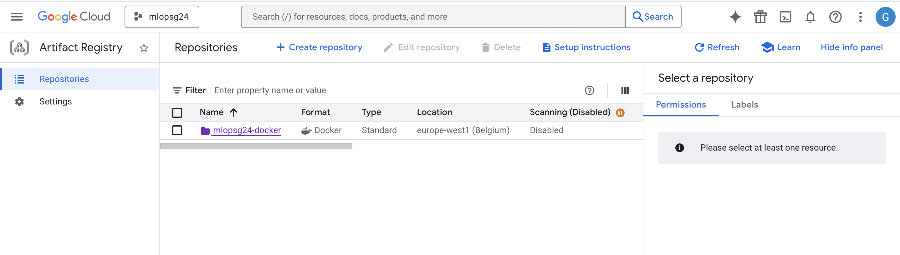
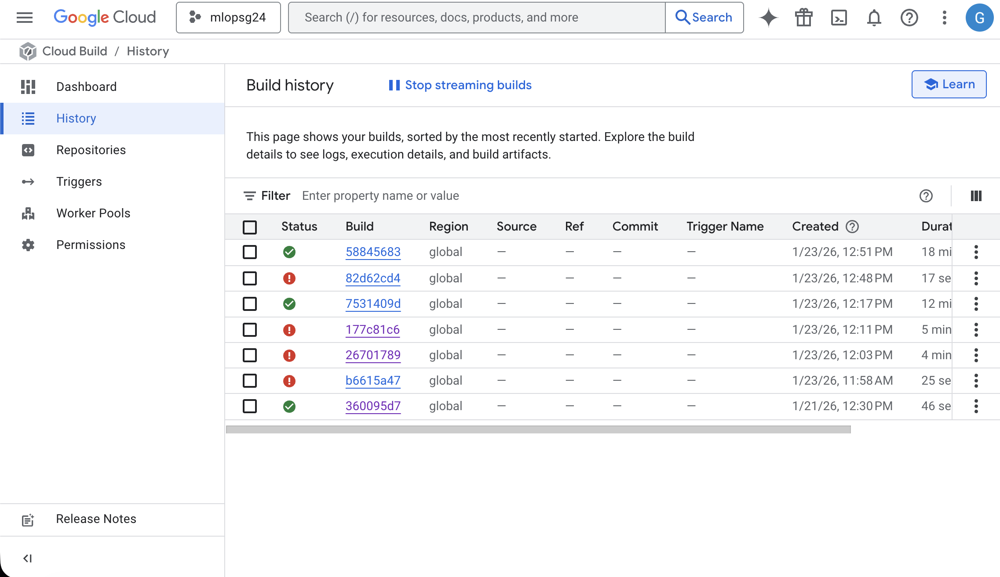

# Exam template for 02476 Machine Learning Operations

This is the report template for the exam. Please only remove the text formatted as with three dashes in front and behind
like:

```--- question 1 fill here ---```

Where you instead should add your answers. Any other changes may have unwanted consequences when your report is
auto-generated at the end of the course. For questions where you are asked to include images, start by adding the image
to the `figures` subfolder (please only use `.png`, `.jpg` or `.jpeg`) and then add the following code in your answer:

``

In addition to this markdown file, we also provide the `report.py` script that provides two utility functions:

Running:

```bash
python report.py html
```

Will generate a `.html` page of your report. After the deadline for answering this template, we will auto-scrape
everything in this `reports` folder and then use this utility to generate a `.html` page that will be your serve
as your final hand-in.

Running

```bash
python report.py check
```

Will check your answers in this template against the constraints listed for each question e.g. is your answer too
short, too long, or have you included an image when asked. For both functions to work you mustn't rename anything.
The script has two dependencies that can be installed with

```bash
pip install typer markdown
```

or

```bash
uv add typer markdown
```

## Overall project checklist

The checklist is *exhaustive* which means that it includes everything that you could do on the project included in the
curriculum in this course. Therefore, we do not expect at all that you have checked all boxes at the end of the project.
The parenthesis at the end indicates what module the bullet point is related to. Please be honest in your answers, we
will check the repositories and the code to verify your answers.

### Week 1

* [x] Create a git repository (M5)
* [x] Make sure that all team members have write access to the GitHub repository (M5)
* [x] Create a dedicated environment for you project to keep track of your packages (M2)
* [x] Create the initial file structure using cookiecutter with an appropriate template (M6)
* [x] Fill out the `data.py` file such that it downloads whatever data you need and preprocesses it (if necessary) (M6)
* [x] Add a model to `model.py` and a training procedure to `train.py` and get that running (M6)
* [x] Remember to fill out the `requirements.txt` and `requirements_dev.txt` file with whatever dependencies that you
    are using (M2+M6)
* [x] Remember to comply with good coding practices (`pep8`) while doing the project (M7)
* [x] Do a bit of code typing and remember to document essential parts of your code (M7)
* [x] Setup version control for your data or part of your data (M8)
* [x] Add command line interfaces and project commands to your code where it makes sense (M9)
* [ ] Construct one or multiple docker files for your code (M10)
* [ ] Build the docker files locally and make sure they work as intended (M10)
* [ ] Write one or multiple configurations files for your experiments (M11)
* [ ] Used Hydra to load the configurations and manage your hyperparameters (M11)
* [x] Use profiling to optimize your code (M12)
* [x] Use logging to log important events in your code (M14)
* [x] Use Weights & Biases to log training progress and other important metrics/artifacts in your code (M14)
* [x] Consider running a hyperparameter optimization sweep (M14)
* [ ] Use PyTorch-lightning (if applicable) to reduce the amount of boilerplate in your code (M15)

### Week 2

* [x] Write unit tests related to the data part of your code (M16)
* [x] Write unit tests related to model construction and or model training (M16)
* [x] Calculate the code coverage (M16)
* [x] Get some continuous integration running on the GitHub repository (M17)
* [x] Add caching and multi-os/python/pytorch testing to your continuous integration (M17)
* [x] Add a linting step to your continuous integration (M17)
* [x] Add pre-commit hooks to your version control setup (M18)
* [ ] Add a continues workflow that triggers when data changes (M19)
* [ ] Add a continues workflow that triggers when changes to the model registry is made (M19)
* [ ] Create a data storage in GCP Bucket for your data and link this with your data version control setup (M21)
* [ ] Create a trigger workflow for automatically building your docker images (M21)
* [ ] Get your model training in GCP using either the Engine or Vertex AI (M21)
* [x] Create a FastAPI application that can do inference using your model (M22)
* [ ] Deploy your model in GCP using either Functions or Run as the backend (M23)
* [x] Write API tests for your application and setup continues integration for these (M24)
* [ ] Load test your application (M24)
* [ ] Create a more specialized ML-deployment API using either ONNX or BentoML, or both (M25)
* [x] Create a frontend for your API (M26)

### Week 3

* [x] Check how robust your model is towards data drifting (M27)
* [ ] Deploy to the cloud a drift detection API (M27)
* [x] Instrument your API with a couple of system metrics (M28)
* [ ] Setup cloud monitoring of your instrumented application (M28)
* [ ] Create one or more alert systems in GCP to alert you if your app is not behaving correctly (M28)
* [ ] If applicable, optimize the performance of your data loading using distributed data loading (M29)
* [ ] If applicable, optimize the performance of your training pipeline by using distributed training (M30)
* [x] Play around with quantization, compilation and pruning for you trained models to increase inference speed (M31)

### Extra

* [x] Write some documentation for your application (M32)
* [ ] Publish the documentation to GitHub Pages (M32)
* [ ] Revisit your initial project description. Did the project turn out as you wanted?
* [x] Create an architectural diagram over your MLOps pipeline
* [ ] Make sure all group members have an understanding about all parts of the project
* [ ] Uploaded all your code to GitHub

## Group information

### Question 1
> **Enter the group number you signed up on <learn.inside.dtu.dk>**
>
> Answer:

> 24

### Question 2
> **Enter the study number for each member in the group**
>
> Example:
>
> *sXXXXXX, sXXXXXX, sXXXXXX*
>
> Answer:

> s251297, s224217, 224181, 246035

### Question 3
> **A requirement to the project is that you include a third-party package not covered in the course. What framework**
> **did you choose to work with and did it help you complete the project?**
>
> Recommended answer length: 100-200 words.****
>
> Example:
> *We used the third-party framework ... in our project. We used functionality ... and functionality ... from the*
>
> Answer:

We used:
- GLiNER2 and SentenceTransformer, both libraries for NLP to clean and transform text into tensors easily used as inputtet for an ANN.
- Polars for more stringent datatypes and readable data transformations.
- Dataframely to do data validation of Polars DataFramses. Data validation is not to be confused with unit testing of data, where the former is a executed when loading data in batches or tables, which is used in the training of a ML model ie. data enginering. Data testing latter is a logical test of the properties of a single data point often user inputtet, which test the boundries of a the inference functionality, ie. software engineering.
- Dataclasses to structure data sent between modules.
- We considered using Pydantic BaseSettings along with .env file to centralise the repos shared settings and variables, but just made a dotenv() example.

## Coding environment

> In the following section we are interested in learning more about you local development environment. This includes
> how you managed dependencies, the structure of your code and how you managed code quality.

### Question 4

> **Explain how you managed dependencies in your project? Explain the process a new team member would have to go**
> **through to get an exact copy of your environment.**
>
> Recommended answer length: 100-200 words
>
> Example:
> *We used ... for managing our dependencies. The list of dependencies was auto-generated using ... . To get a*
> *complete copy of our development environment, one would have to run the following commands*
>
> Answer:

> We used UV for managing dependencies. We used uv add when adding new packages to automatically add the packages to pyproject.toml and the exact method of installation to uv.lock. uv sync --dev --locked would sync to the virtual environment we used. We also used Dependabot to automatically find upgrades with GitHub Actions.

### Question 5

> **We expect that you initialized your project using the cookiecutter template. Explain the overall structure of your**
> **code. What did you fill out? Did you deviate from the template in some way?**
>
> Recommended answer length: 100-200 words
>
> Example:
> *From the cookiecutter template we have filled out the ... , ... and ... folder. We have removed the ... folder*
> *because we did not use any ... in our project. We have added an ... folder that contains ... for running our*
> *experiments.*
>
> Answer:

- We used the MLOPS course cookiecutter template. The overall structre follows src/package_name convention which comforms to what uv build expects, whihc is the build system we use. We considered further folders to subdivede the content of src/package_name such as modules, core, inference etc, but we hope that the CLI in task.py work as an entry point to show the structure of the modules.*
- task.py is situated at root, it would be cleaner to put .py files into src/. Typer does this nicely where a `[project.scripts] cli entry point` can be defined*
- we have kept the folders we use an removed the ones we did not*

### Question 6

> **Did you implement any rules for code quality and format? What about typing and documentation? Additionally,**
> **explain with your own words why these concepts matters in larger projects.**
>
> Recommended answer length: 100-200 words.
>
> Example:
> *We used ... for linting and ... for formatting. We also used ... for typing and ... for documentation. These*
> *concepts are important in larger projects because ... . For example, typing ...*
>
> Answer:

We implemented a ruff github workflow check, but removed it again because it kept failing. Ruff is also a bit too strict to be used as a workflow, more of a warning that can be used on demand in the VScode linting using for example pylance quickfix. It felt too uncontrollable to have ruff autoformat everything. We have done this by defining the fomratting in pyroject.toml [tool.ruff] section

## Version control

> In the following section we are interested in how version control was used in your project during development to
> corporate and increase the quality of your code.

### Question 7

> **How many tests did you implement and what are they testing in your code?**
>
> Recommended answer length: 50-100 words.
>
> Example:
> *In total we have implemented X tests. Primarily we are testing ... and ... as these the most critical parts of our*
> *application but also ... .*
>
> Answer:

We implemented 3 unit test testing the data preprocessing module. We implemented two integration tests of FastAPI. The integration test used a contex manager to ensure that the app runs it lifetime section.

### Question 8

> **What is the total code coverage (in percentage) of your code? If your code had a code coverage of 100% (or close**
> **to), would you still trust it to be error free? Explain you reasoning.**
>
> Recommended answer length: 100-200 words.
>
> Example:
> *The total code coverage of code is X%, which includes all our source code. We are far from 100% coverage of our **
> *code and even if we were then...*
>
> Answer:

Using the following command on our source code: uv run coverage run --source=src/mlopsg24 -m pytest tests/ , we got a coverage of 30%. This is not a lot, and we should write much more if it was for a "real" project, but coverage also does not tell the full story, as you can write a lot of bad tests and get 100%, or have very large functions and only test small parts of them.

### Question 9

> **Did you workflow include using branches and pull requests? If yes, explain how. If not, explain how branches and**
> **pull request can help improve version control.**
>
> Recommended answer length: 100-200 words.
>
> Example:
> *We made use of both branches and PRs in our project. In our group, each member had an branch that they worked on in*
> *addition to the main branch. To merge code we ...*
>
> Answer:

We did not implement pull request. We working on separate branches, using the branching starategy that each users had their separate branch. We made our individual changes in our own branch and then merge them to main

### Question 10

> **Did you use DVC for managing data in your project? If yes, then how did it improve your project to have version**
> **control of your data. If no, explain a case where it would be beneficial to have version control of your data.**
>
> Recommended answer length: 100-200 words.
>
> Example:
> *We did make use of DVC in the following way: ... . In the end it helped us in ... for controlling ... part of our*
> *pipeline*
>
> Answer:

We did not use DVC for our project. It would be relevant for our project if the data was to change, since it is a large dataset and DVC makes it easy to work with version control without copying the entire dataset into github every time. It would also work well with WANDB and for working with data drifting.

### Question 11

> **Discuss you continuous integration setup. What kind of continuous integration are you running (unittesting,**
> **linting, etc.)? Do you test multiple operating systems, Python  version etc. Do you make use of caching? Feel free**
> **to insert a link to one of your GitHub actions workflow.**
>
> Recommended answer length: 200-300 words.
>
> Example:
> *We have organized our continuous integration into 3 separate files: one for doing ..., one for running ... testing*
> *and one for running ... . In particular for our ..., we used ... .An example of a triggered workflow can be seen*
> *here: <weblink>*
>
> Answer:

We made a simple ruff test for linting into a GitHub Workflow. The workflow running the integration test is set to only run on linux, as the test downloads a huggingface model each time. we implemented caching of python, but skipped trying to cache the HF model. It would require that the workflow sets up defined cache for the HF model, or that the integrationtest is not made at the API endpoint but at code sections constitutiong the API*


## Running code and tracking experiments

> In the following section we are interested in learning more about the experimental setup for running your code and
> especially the reproducibility of your experiments.

### Question 12

> **How did you configure experiments? Did you make use of config files? Explain with coding examples of how you would**
> **run a experiment.**
>
> Recommended answer length: 50-100 words.
>
> Example:
> *We used a simple argparser, that worked in the following way: Python  my_script.py --lr 1e-3 --batch_size 25*
>
> Answer:

We used the argparse python package for handling arguments. The training file can be called with uv run or python3, for example from the root to train for 15 epochs with learning rate 1e-3, and quantize model weights to int8 and prune the 20% smallest weights:
uv run src/mlopsg24/train.py --epochs 15 --lr 1e-3 --quantize --prune

### Question 13

> **Reproducibility of experiments are important. Related to the last question, how did you secure that no information**
> **is lost when running experiments and that your experiments are reproducible?**
>
> Recommended answer length: 100-200 words.
>
> Example:
> *We made use of config files. Whenever an experiment is run the following happens: ... . To reproduce an experiment*
> *one would have to do ...*
>
> Answer:

The experiments were logged in Weights and Biases. For every run, the training loss, validation set accuracies for every epoch, a confusion matrix, and a histogram of the gradients are saved. Moreover, an artifact is also saved that contains the final test set accuracy, the model itself, information about the computer that ran it, batch size, epochs and learning-rate. The experiments were not seeded, but are reproducible in the sense that that the project code works in our docker training file and converge to the approximately the same result in many repeated experiments.

### Question 14

> **Upload 1 to 3 screenshots that show the experiments that you have done in W&B (or another experiment tracking**
> **service of your choice). This may include loss graphs, logged images, hyperparameter sweeps etc. You can take**
> **inspiration from [this figure](figures/wandb.png). Explain what metrics you are tracking and why they are**
> **important.**
>
> Recommended answer length: 200-300 words + 1 to 3 screenshots.
>
> Example:
> *As seen in the first image when have tracked ... and ... which both inform us about ... in our experiments.*
> *As seen in the second image we are also tracking ... and ...*
>
> Answer:

Result from the hyperparameter sweep run of the validation set prediction accuracies, where it looks like experiments with lower learning rate had too few epochs to converge:
[Sweep: Validation accuracy](figures/valacc.png)

Result from the hyperparameter sweep run of the resulting confusion matrices, where the models that did not converge had worse performance:
[Sweep: Confusion matrix](figures/confus.png)

And result from the hyperparameter sweep run of how the batch size and learning rate impacted the final validation accuracy, where it can be seen that the learning rate was very important and the batch size was not.
[Sweep: Parameters](figures/sweepimg.png)


### Question 15

> **Docker is an important tool for creating containerized applications. Explain how you used docker in your**
> **experiments/project? Include how you would run your docker images and include a link to one of your docker files.**
>
> Recommended answer length: 100-200 words.
>
> Example:
> *For our project we developed several images: one for training, inference and deployment. For example to run the*
> *training docker image: `docker run trainer:latest lr=1e-3 batch_size=64`. Link to docker file: <weblink>*
>
> Answer:

--- question 15 fill here ---

### Question 16

> **When running into bugs while trying to run your experiments, how did you perform debugging? Additionally, did you**
> **try to profile your code or do you think it is already perfect?**
>
> Recommended answer length: 100-200 words.
>
> Example:
> *Debugging method was dependent on group member. Some just used ... and others used ... . We did a single profiling*
> *run of our main code at some point that showed ...*
>
> Answer:

We used VScode's debugger. In VScode Keyboard Shortcuts we have activated `Debug: Evaluate in Debug Console.` to run selected line in python file in the debug terminal console. We also used VScode's debugger to develop new smaller features or feature changes. We used profiling to look for bottlenecks in the training loop, but the model trains very fast, and there were no obvious bottlenecks. If the model was to be deployed for a company, we would look into how to make the embedder more efficient instead.

## Working in the cloud

> In the following section we would like to know more about your experience when developing in the cloud.

### Question 17

> **List all the GCP services that you made use of in your project and shortly explain what each service does?**
>
> Recommended answer length: 50-200 words.
>
> Example:
> *We used the following two services: Engine and Bucket. Engine is used for... and Bucket is used for...*
>
> Answer:

We used the following GCP services:
- **Compute Engine**: VM instances for running training (CPU + GPU) and debugging runs.
- **Cloud Storage (GCS)**: storing our processed dataset artifacts (e.g. `data/processed/*.pt`) and moving data between local and the VM.
- **Artifact Registry**: storing Docker images built for the API.
- **Cloud Build**: building/pushing Docker images to Artifact Registry from our repository.
- **Cloud Run**: attempted deployment target for a CPU online inference endpoint.
- **Cloud Logging / Log Explorer**: inspecting runtime logs from builds and deployments.

### Question 18

> **The backbone of GCP is the Compute engine. Explained how you made use of this service and what type of VMs**
> **you used?**
>
> Recommended answer length: 100-200 words.
>
> Example:
> *We used the compute engine to run our ... . We used instances with the following hardware: ... and we started the*
> *using a custom container: ...*
>
> Answer:

We used Compute Engine to run training jobs remotely so we were not limited by local machine performance or local dependency constraints.

We used two VM setups:
- A **CPU VM** for initial end-to-end verification.
- A **GPU VM** for faster training (we used an NVIDIA T4 when our preferred GPU type/zone had capacity issues).

Our workflow was: connect with `gcloud compute ssh`, download the processed dataset from a GCS bucket using `gsutil`, then start training with our existing script using `uv run src/mlopsg24/train.py ...`. The outputs (model checkpoint under `models/` and figures under `reports/figures/`) were generated on the VM and copied back when needed.

### Question 19

> **Insert 1-2 images of your GCP bucket, such that we can see what data you have stored in it.**
> **You can take inspiration from [this figure](figures/bucket.png).**
>
> Answer:



### Question 20

> **Upload 1-2 images of your GCP artifact registry, such that we can see the different docker images that you have**
> **stored. You can take inspiration from [this figure](figures/registry.png).**
>
> Answer:



### Question 21

> **Upload 1-2 images of your GCP cloud build history, so we can see the history of the images that have been build in**
> **your project. You can take inspiration from [this figure](figures/build.png).**
>
> Answer:



### Question 22

> **Did you manage to train your model in the cloud using either the Engine or Vertex AI? If yes, explain how you did**
> **it. If not, describe why.**
>
> Recommended answer length: 100-200 words.
>
> Example:
> *We managed to train our model in the cloud using the Engine. We did this by ... . The reason we choose the Engine*
> *was because ...*
>
> Answer:


We trained our model in the cloud using Google Compute Engine (Engine). We created and used a VM in our GCP project (`mlopsg24`) and connected to it using `gcloud compute ssh`. Our processed dataset (PyTorch tensors for train/val/test) was stored in Google Cloud Storage under `data/processed/`, and we downloaded it onto the VM using `gsutil`.

Training was started on the VM by running our training script with `uv`, e.g. `WANDB_MODE=disabled uv run src/mlopsg24/train.py --data-dir data/processed --epochs 20`. The run completed in the cloud and produced artifacts on the VM (a saved model checkpoint under `models/` and evaluation figures under `reports/figures/`). We used Compute Engine because it gave us a straightforward way to run longer experiments on remote hardware without changing our code to fit a managed training service.

## Deployment

### Question 23

> **Did you manage to write an API for your model? If yes, explain how you did it and if you did anything special. If**
> **not, explain how you would do it.**
>
> Recommended answer length: 100-200 words.
>
> Example:
> *We did manage to write an API for our model. We used FastAPI to do this. We did this by ... . We also added ...*
> *to the API to make it more ...*
>
> Answer:

We wrote an API in FastAPI. This provided an endpoint for the classificaiton, and also returns usefull data of the predictions, susch as the probability distribution of the predciton the the classes. We also tryed to add a batch api process, but it would require refactioring the function that the API calls to expose the parts that can be batched


### Question 24

> **Did you manage to deploy your API, either in locally or cloud? If not, describe why. If yes, describe how and**
> **preferably how you invoke your deployed service?**
>
> Recommended answer length: 100-200 words.
>
> Example:
> *For deployment we wrapped our model into application using ... . We first tried locally serving the model, which*
> *worked. Afterwards we deployed it in the cloud, using ... . To invoke the service an user would call*
> *`curl -X POST -F "file=@file.json"<weburl>`*
>
> Answer:

Yes. We deployed the API locally. To achieve the local deployment we used FastAPI's TestAPI  which tough meant for integration tests can also be used for a a localhosted API. This is ok for demonstration purposes of a frontend.


### Question 25

> **Did you perform any unit testing and load testing of your API? If yes, explain how you did it and what results for**
> **the load testing did you get. If not, explain how you would do it.**
>
> Recommended answer length: 100-200 words.
>
> Example:
> *For unit testing we used ... and for load testing we used ... . The results of the load testing showed that ...*
> *before the service crashed.*
>
> Answer:

Yes. We made two integration test of the API. The first, tests that the root health message is functioning. The second sends a mock call to the api and tests if the prediction has properties that must be true. The second test therefore requires the full inference classifier pipeline to function.

### Question 26

> **Did you manage to implement monitoring of your deployed model? If yes, explain how it works. If not, explain how**
> **monitoring would help the longevity of your application.**
>
> Recommended answer length: 100-200 words.
>
> Example:
> *We did not manage to implement monitoring. We would like to have monitoring implemented such that over time we could*
> *measure ... and ... that would inform us about this ... behaviour of our application.*
>
> Answer:

We implemented a data drift reporting module that can be called on demand. It uses evidently and checks if there are datadrift at the categorical data - which is still human readable, and at the embeddings - where ee only loaded a subset as the load time was quite large. The data drift report compares training to test data, and embeddings from 2022 to 2024 as a demonstration. A proper data drift report would compare an old data used for training to prediction data or newer labels

## Overall discussion of project

> In the following section we would like you to think about the general structure of your project.

### Question 27

> **How many credits did you end up using during the project and what service was most expensive? In general what do**
> **you think about working in the cloud?**
>
> Recommended answer length: 100-200 words.
>
> Example:
> *Group member 1 used ..., Group member 2 used ..., in total ... credits was spend during development. The service*
> *costing the most was ... due to ... . Working in the cloud was ...*
>
> Answer:

--- question 27 fill here ---

### Question 28

> **Did you implement anything extra in your project that is not covered by other questions? Maybe you implemented**
> **a frontend for your API, use extra version control features, a drift detection service, a kubernetes cluster etc.**
> **If yes, explain what you did and why.**
>
> Recommended answer length: 0-200 words.
>
> Example:
> *We implemented a frontend for our API. We did this because we wanted to show the user ... . The frontend was*
> *implemented using ...*
>
> Answer:

We implemented a streamlit frontend which for demonstration are run on localhost, using CLI task lfrontend. We made the frontend ready to switch between localhost and a cloud hosted endpoint. The frontend uses FastAPIs lifetime management to only load trained models at startup, and delete them from memory afterwards


### Question 29

> **Include a figure that describes the overall architecture of your system and what services that you make use of.**
> **You can take inspiration from [this figure](figures/overview.png). Additionally, in your own words, explain the**
> **overall steps in figure.**
>
> Recommended answer length: 200-400 words
>
> Example:
>
> *The starting point of the diagram is our local setup, where we integrated ... and ... and ... into our code.*
> *Whenever we commit code and push to GitHub, it auto triggers ... and ... . From there the diagram shows ...*
>
> Answer:
>
We made [this figure](../docs/images/architecture.png), which is also the root README.md. It shows a inference pipeline and a retraining pipeline.*
- Inference pipeline: Illustrates a user sending a job vacancy input (green) to the streamlit frontend, it then sents the unprocessed text to the cloud hosted docker image, then further to the data preprocessing, then text embeddings to the classifyier, then a classification dataclass to the inference pipeline and a dict to FastAPI, then a json back to docker, which then present the classification results to the user.*
- Retraining: Illustrates a developer that is alerted thorugh the datadrift rpeort, that retraing is overdue. He then triggers the training process, an uses new training data, assuming he as training data. A new model is trained and he replaces the old model with the updated one at the inference pipeline*


### Question 30

> **Discuss the overall struggles of the project. Where did you spend most time and what did you do to overcome these**
> **challenges?**
>
> Recommended answer length: 200-400 words.
>
> Example:
> *The biggest challenges in the project was using ... tool to do ... . The reason for this was ...*
>
> Answer:

--- question 30 fill here ---

### Question 31

> **State the individual contributions of each team member. This is required information from DTU, because we need to**
> **make sure all members contributed actively to the project. Additionally, state if/how you have used generative AI**
> **tools in your project.**
>
> Recommended answer length: 50-300 words.
>
> Example:
> *Student sXXXXXX was in charge of developing of setting up the initial cookie cutter project and developing of the*
> *docker containers for training our applications.*
> *Student sXXXXXX was in charge of training our models in the cloud and deploying them afterwards.*
> *All members contributed to code by...*
> *We have used ChatGPT to help debug our code. Additionally, we used GitHub Copilot to help write some of our code.*
> Answer:

- s251297: made data_create data_preprocess, inference, api, frontend, data_drift, unittest of preprocess, integration test of api, pre-commit-config, several CLI invoke tasks, github workflows, mkdocs.
- s251297 used GenAI to write prototypes of programs, write code snippets, to help understand bugs and as a Teaching Assistent.
- s224217: Validation/test sets in training, logger in training and wandb + hyperparameter sweeps, profiling, coverage, quantization and pruning.
- s224217 used GenAI for questions about the course material and package documentation.